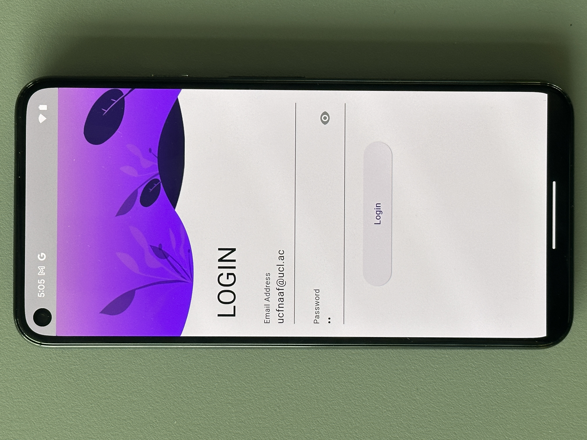
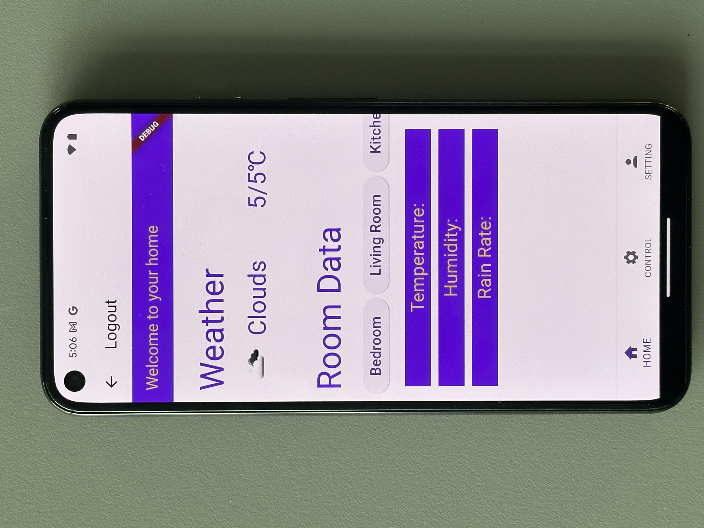
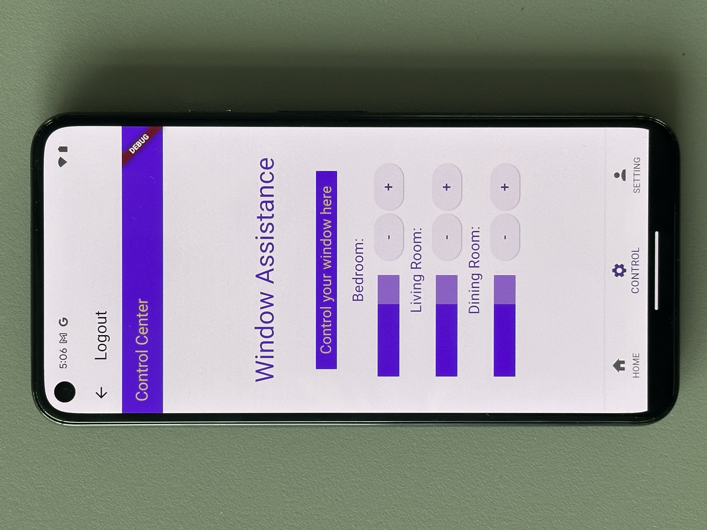
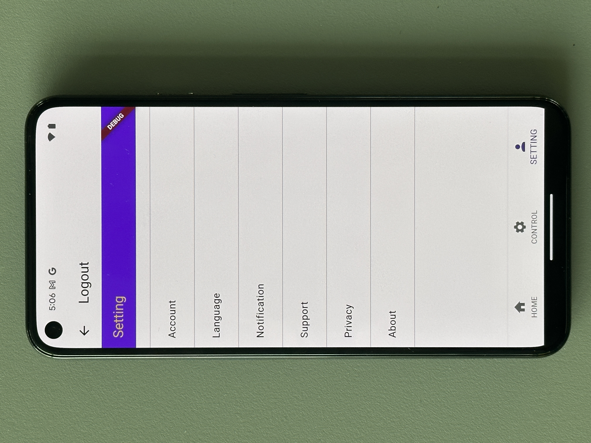
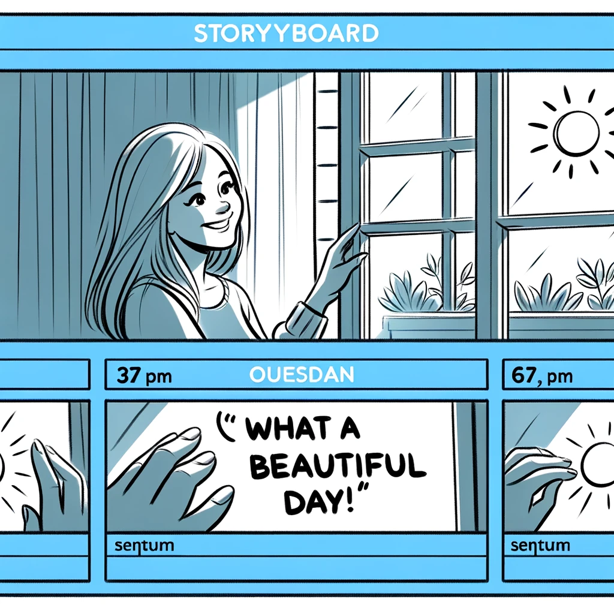
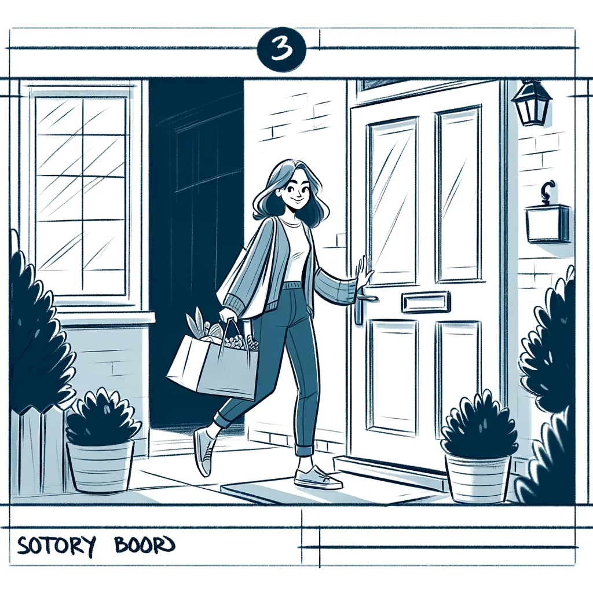
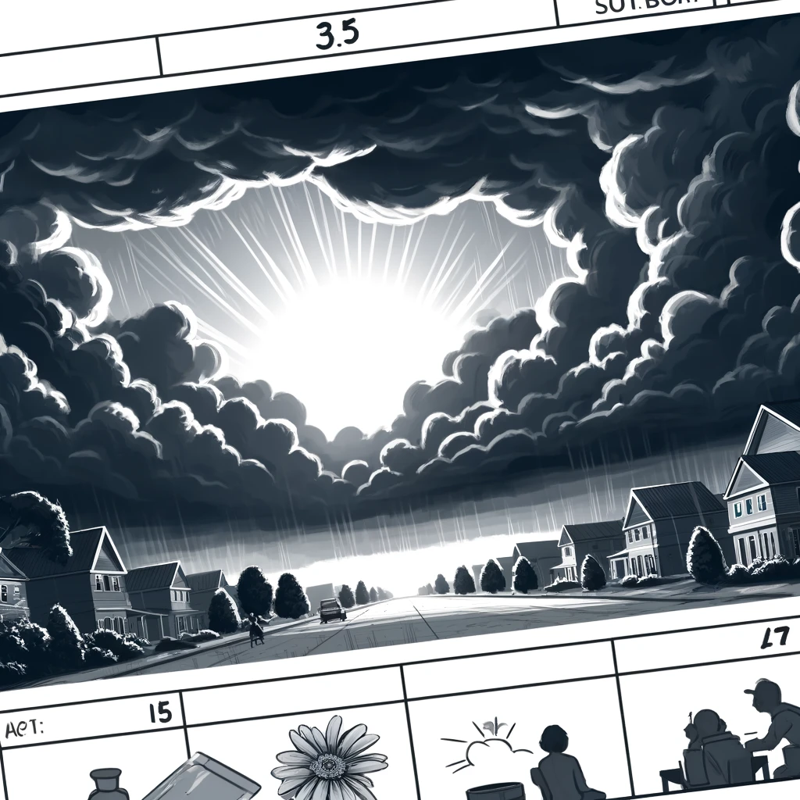
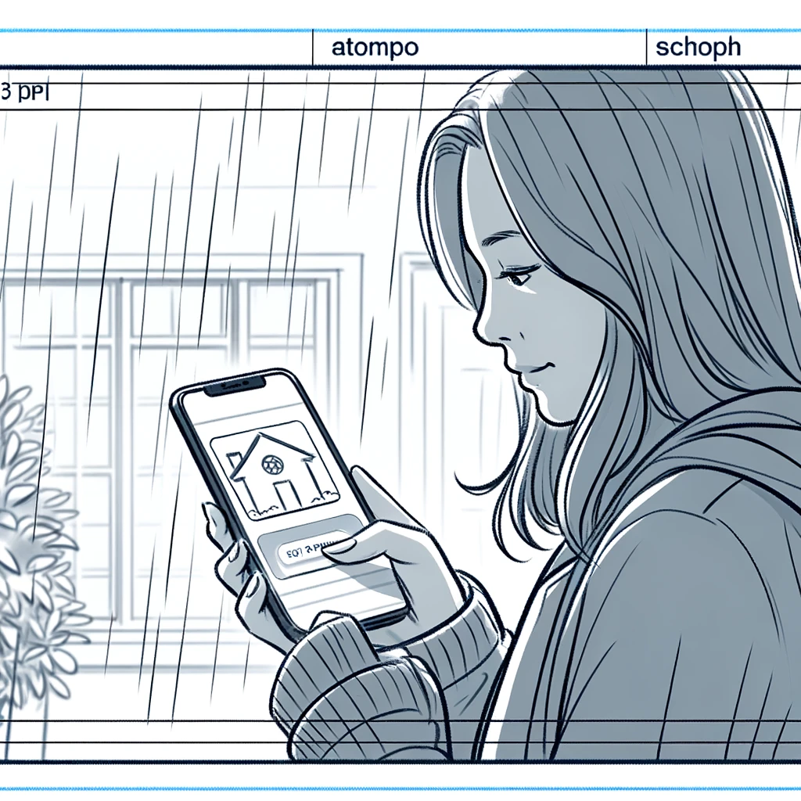
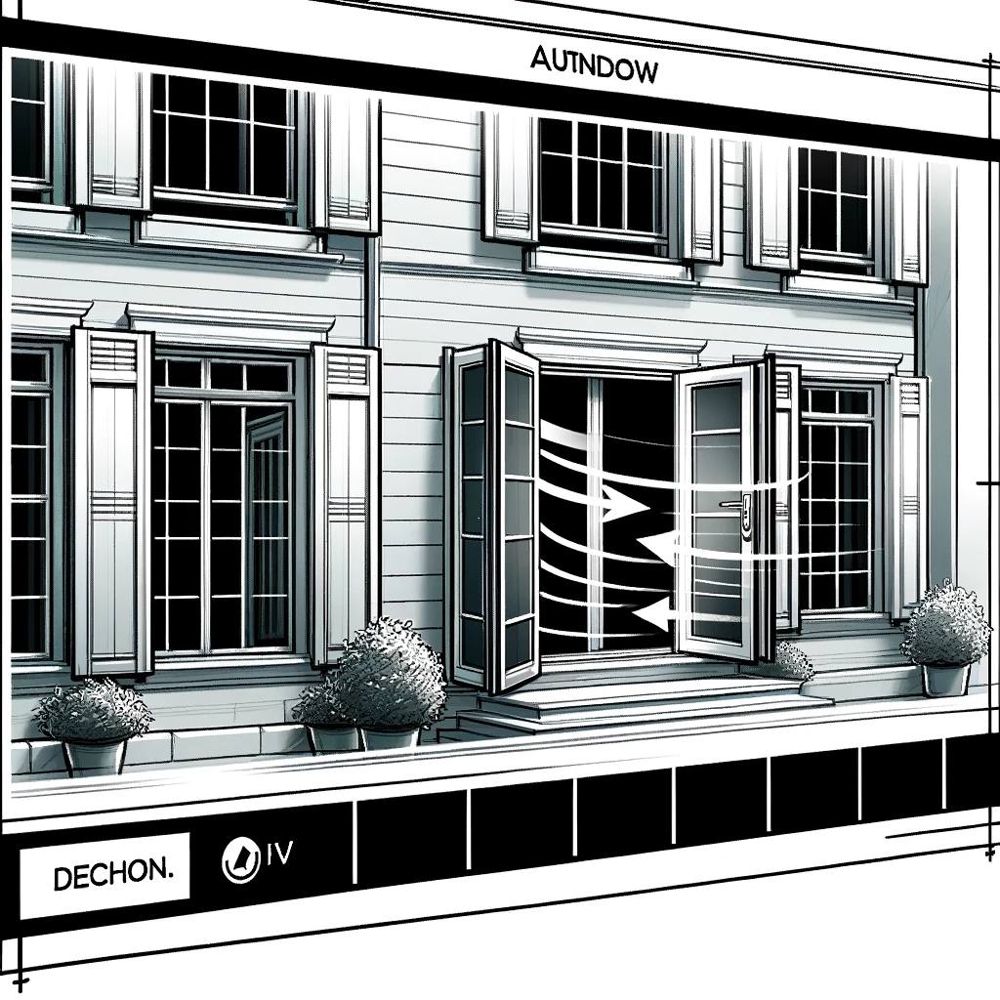
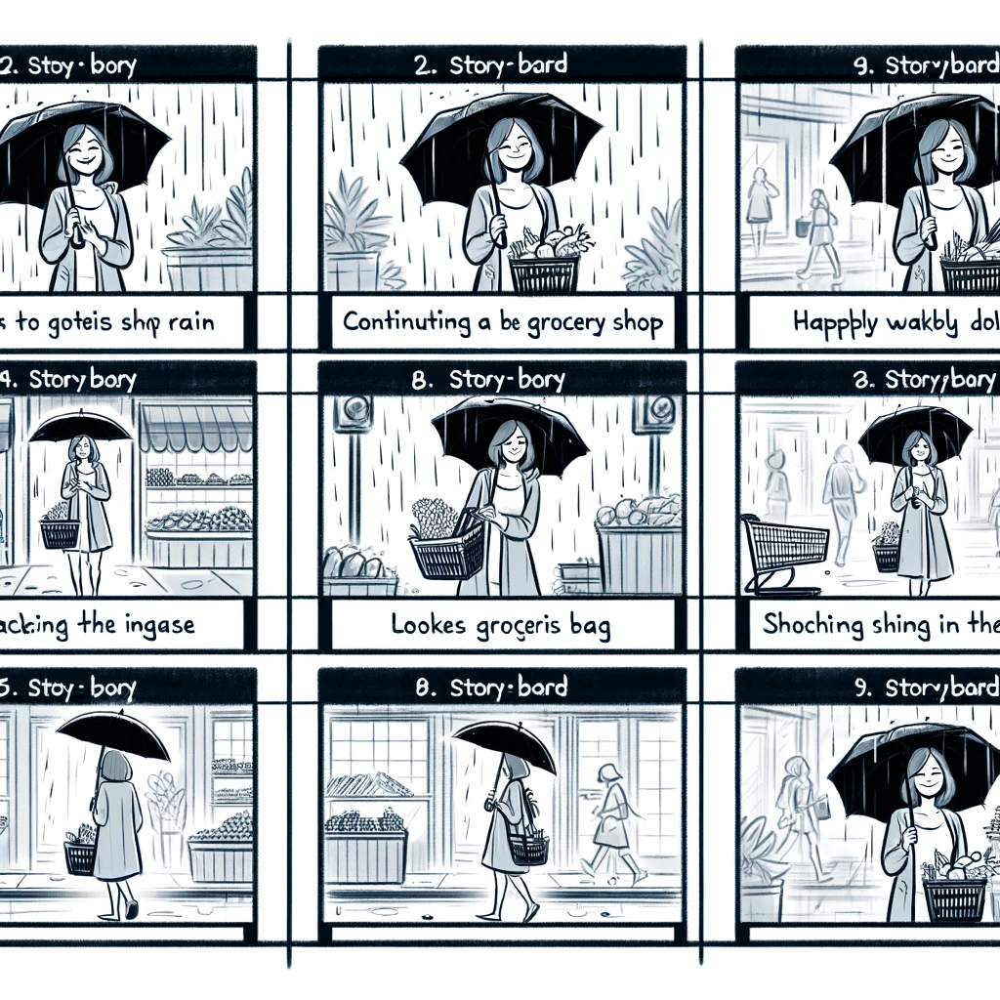

# :house:Home Assistance For Windows in house

This app is a home assistance for window created with Flutter, which can provide weather status and monitor humidity,temperature of each room in the house and, most importantly, the rainrate near the window of each room in order to protect user's house from the damage of rain even when there are not people at home. :umbrella:

#### It is not completed yet, more features are expected to be added. 

## :iphone:Screenshot:

:closed_lock_with_key:Login Page:

:cloud:Home Page (Weather and home status visulization):

:wrench:Control Page (Control the windows here!):

:man:Account Page:

## :sparkler:Features: 

 * Data visualisation
   * Real-time weather data visualization from Openweathermap API
   * Real-time sensor data visualization in each home including temperature, humidity and rainrate from MQTT broker.
   * Switch room to check the statu of different room by the button list on the top of data
 * Window controller
   * Open/Close window by the button shown on control page
   * Real-time window angle data visualization on the bar besides buttons
 * User customization 

## :woman:User experience
A woman opening a window in her house and seeing the bright, sunny weather outside. She smiles and says, 'What a beautiful day!'

She leaving her house to buy groceries. She step out of her front door, holding a shopping bag. 

However, a sudden change in weather happens with dark clouds covering the sky.

And then, she open the 'Home Window Assistance' app in her phone, and try to close the windows.

After that, the windows in her house automatically close without anyone at home.

Finally, with the help of this app, she is able to continue her shopping rather than turning back to close the windows in her house.

## :computer:Installation

Download the whole project folder and unzip it. Open it with your flutter in VScode.
* :key:Two key things need to be noticed:
  * Change the MQTT broker to your own one and subscribe to your own topics
  * Use your own API key to get weather service, which can be easily and free to apply at https://openweathermap.org/

## :mailbox:Contact Details

Feel free to contact me when you have any trouble with this project. My email is: doubleuang2001@163.com
